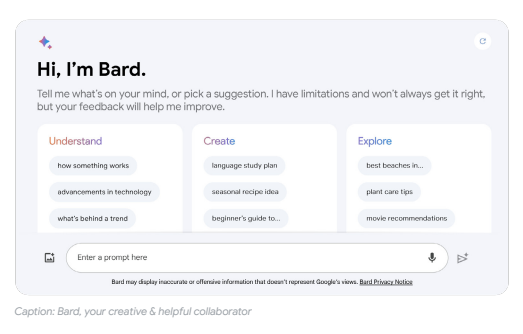
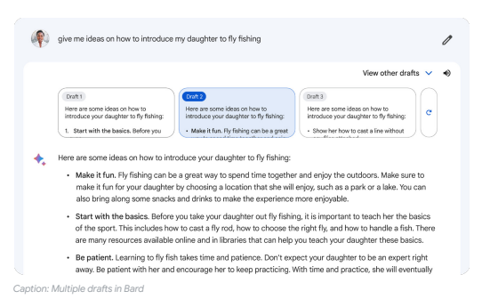
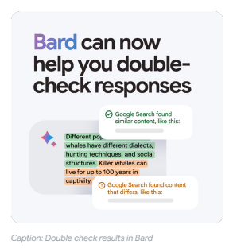
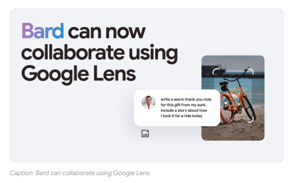
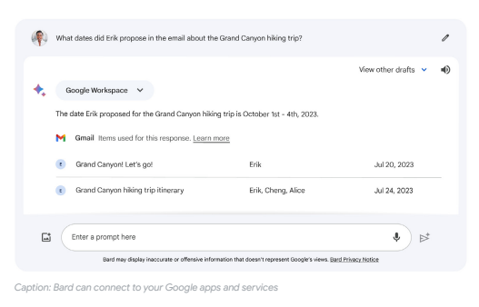

## An Overview Of Bard: An Early Experiment With Generative Ai

James Manyika, SVP, Research, Technology and Society, and **Sissie Hsiao,** Vice President and General Manager, Google Assistant and Bard Editor's note: This is a living document and will be updated periodically as we continue to rapidly improve Bard's capabilities as well as address the limitations inherent to LLMs. This explainer was last updated on October 19, 2023. For the latest updates on Bard, visit the Experiment Updates log or read more on the *Google Keyword blog.*
We have long seen the potential of AI to make information and computing more accessible and useful to people. As part of this journey, we have made pioneering advancements on large language models (LLMs) and have seen great progress across Google and in this field more broadly. For several years, we have applied LLMs in the background to improve many of our products, such as autocompleting sentences in Gmail, expanding Google Translate, and helping us better understand queries in Google Search. Now, we are using LLMs to power Bard, an experiment that allows people to collaborate directly with generative AI. While we're at an important inflection point and encouraged by the widespread excitement around generative AI, it's still early days for this technology. The following outlines how we are approaching our work on Bard - what it is, how it works and its current capabilities and limitations. Our approach to Bard will evolve as Bard itself (and its underlying technology) does, and as we learn from ongoing research, experience and user feedback.

## What Bard Is

Bard is designed as an interface to an LLM that enables users to collaborate with generative AI. We believe one of the promises of LLM-based innovations like Bard is to help people unlock their human potential so they can augment their imagination, expand their curiosity, and enhance their productivity. We launched Bard as an experiment in March 2023. Since then, we have iterated quickly to expand its capabilities - always in accordance with our AI Principles. We continue to engage with industry experts, educators, policymakers, civil rights and human rights leaders, content creators and others to learn about the many possible applications, as well as the risks and limitations, of this emerging technology, and how we might improve it. We think Bard is most helpful right now as a standalone experiment. It best allows us to understand exactly how people want to use this novel technology for their own collaboration - and that understanding will enable us to make it even better over time. We see it as a complementary experience to Google Search. Over the past few months, we have learned that people come to Bard for help with all sorts of projects - like writing resumes, creating workout routines and planning complex trip itineraries. The following categories are an illustrative subset, and we look forward to continuing to learn from the many new ways people use Bard so we can further improve the experience.

## Productivity

We believe users will be able to maximize their time by collaborating with Bard. For example, say a user is planning a party; Bard can help them come up with their to-do list and draft an outline of the invitation - helping free up the user's time and brainspace to dedicate to higher-level tasks. Bard can also help with coding tasks, and coding has quickly become one of the most popular things people do with Bard.

## Creativity

Bard can also help bring a user's ideas to life or spark their creativity in new ways. For example, if a user is writing a blog post, Bard can outline it - providing a starting point so they do not have to face a blank page. We also see Bard inspire creativity by generating poems, short stories, taglines and other imaginative endeavors.

## Curiosity

Bard can be a jumping off point for users' curiosity as they explore ideas or topics of interest. For instance, Bard can explain a complex concept simply or surface relevant insights on a topic, which might inspire a user to explore and learn more. 

## How Bard Works Pre-Training

2 An overview of Bard: an early experiment with generative AI
Bard is powered by one of our most capable large language models, and, similar to most LLMs today, was pre-trained on a variety of data from publicly available sources. This pre-training allows the model to learn to pick up on patterns in language and use them to predict the next probable word or words in a sequence. For example, as an LLM learns, it can predict that the next word in "peanut butter and ___'' is more likely to be "jelly" than, say, "shoelace." However, if an LLM picks only the most probable next word, it will lead to less creative responses. So LLMs are often given flexibility to pick from reasonable, albeit slightly less probable, choices in order to generate more interesting responses. It's worth noting that - although LLMs can at times perform well on factual prompts and create the impression of retrieving information - they are neither information databases nor deterministic information retrieval systems. So while a user can expect exactly the same and consistent response to a database query (one that is a literal retrieval of the information stored in it), the response from an LLM to the same prompt will not necessarily be the same every time (nor will it necessarily be a literal retrieval of the information it was trained on); all this is a result of the LLM's underlying mechanism of predicting the next word. This is also an important factor in why LLMs can generate plausiblesounding responses that can at times contain factual errors. 

## Responses To User Prompts

Once a user provides a prompt, Bard uses the context in the prompt and the interaction with the user to draft several versions of a response. Bard then classifies and checks its responses against predetermined safety parameters. Responses that pass through these technical guardrails are then re-ranked based on quality, with the higher-quality response, or responses, provided back to the user. 

## Human Feedback And Evaluation

3 An overview of Bard: an early experiment with generative AI
Our early work on instruction fine-tuning on FLAN demonstrated that fine-tuning with a relatively small amount of human assistance and feedback, as well as additional engineering, provided in various forms (e.g., fine-tuning, well-designed prompt engineering and user prompting, corrections or modeling of what a highquality response would look like, or even users simply giving thumbs up or down) can help a model learn and improve. So if responses are flagged in Bard, trained human reviewers look at them to assess their quality related to the input prompt and determine if Bard's response is low-quality, inaccurate or harmful. From there, trained evaluators suggest higher-quality responses in line with a defined set of policies, and these are then used as fine-tuning data to provide Bard a better dataset to learn from so it can produce improved responses in the future. To further improve Bard, we use a technique called Reinforcement Learning on Human Feedback (RLHF), which improves LLMs based on human preference feedback. We've learned a lot through the AI Test Kitchen and our Trusted Tester programs, and the next critical step in meaningfully improving Bard is getting a wider range of experts' and users' feedback and evaluation. 

## Known Limitations Of Llm-Based Interfaces Like Bard

Bard is part of our long-term, ongoing effort to develop LLMs responsibly, and throughout the course of this work, we have discovered and discussed several limitations associated with LLMs. Here, we focus on five areas that we continue to work on: (a) accuracy: Bard's responses might be inaccurate, especially when asked about complex or factual topics; (b) bias: Bard's responses might reflect biases or perspectives present in its training data; (c) persona: Bard's responses might suggest it as having personal opinions or feelings, and (d) false positives and false negatives: Bard might not respond to some appropriate prompts and provide inappropriate responses to others, and (e) vulnerability to adversarial prompting: users will find ways to stress test Bard further. These are areas of research that we and the broader field are looking to address, and we at Google are committed to working to improve them over time.

## Accuracy

Bard is grounded in Google's understanding of quality information, and is trained to generate responses that are relevant to the context and in line with users' intent. But like all LLMs, Bard can sometimes generate responses that contain inaccurate or misleading information while presenting it confidently and convincingly. Since the underlying mechanism of an LLM is that of predicting the next word or sequences of words, LLMs are not fully capable yet of distinguishing between what is accurate and inaccurate information. For example, if you ask an LLM to solve a mathematical word problem, it will predict an answer based on others it's learned from, not based on advanced reasoning or computations. To this end, we have seen Bard present responses that contain or even invent inaccurate information (e.g., misrepresenting how it was trained, suggesting the name of a book that doesn't exist).

## Bias

Training data, including from publicly available sources, reflects a diversity of perspectives and opinions. We continue to research how to use this data in a way that ensures that an LLM's response incorporates a wide range of viewpoints, while preventing offensive responses.

4 An overview of Bard: an early experiment with generative AI
Gaps, biases and stereotypes in training data can result in a model reflecting those in its outputs as it tries to predict a plausible response. We see these issues manifest in a number of ways (e.g., responses that reflect only one culture or demographic, reference problematic stereotypes, or exhibit gender, religious, or ethnic biases). For some topics, there are data voids - in other words, there isn't enough reliable information about a given subject for the LLM to learn about it and then make good predictions. In these cases, we see an increase in low-quality or inaccurate information generation. Building a safe experience on Bard means building an experience that is safe for everyone, and this is an ongoing area of focus. We continue to improve Bard's training data as well as the system through ongoing fine-tuning. And we are conducting research with domain experts and a diversity of communities to build out roadmaps for domains where there is deep expertise outside of Google. For subjective topics, such as politics, Bard is designed to provide users with multiple perspectives. For example, if prompted on something that cannot be verified by primary source facts or well-established expert consensus - like a subjective opinion on best or worse - Bard should respond in a way that reflects a wide range of viewpoints. But since LLMs like Bard train on the content publicly available on the internet, they can reflect positive or negative views of specific politicians, celebrities or other public figures, or even incorporate views on certain sides of controversial social or political issues into their responses. Bard should not respond in a way that endorses a particular viewpoint on these topics, and we will use feedback on these types of responses to train Bard to better address them. 

## Persona

Bard might at times generate responses that seem to suggest it has opinions or emotions, like love or sadness, since it has trained on language that people use to reflect the human experience. We have developed a set of guidelines around how Bard might represent itself (i.e., persona) and continue to finetune the model to provide objective, neutral responses. 

## False Positives / Negatives

To prevent Bard from responding to prompts it's not yet trained to address or outputting harmful or offensive content, we've put in place a set of technical guardrails. The goal of these guardrails is to prevent problematic responses, but Bard can sometimes misinterpret these guardrails, producing "false positives" and "false negatives." In a "false positive," Bard might not provide a response to a reasonable prompt, misinterpreting the prompt as inappropriate; and in a "false negative," Bard might generate an inappropriate response, despite the guardrails in place. We will continue tuning these models to better understand and categorize safe inputs and outputs, and this remains ongoing as language, events and society rapidly evolve. 

## Vulnerability To Adversarial Prompting

We expect users to test the limits of what Bard can do and attempt to break Bard's protections, including trying to get it to divulge its training data or other information, or try to get around its safety mechanisms. We have tested and continue to test Bard rigorously, but we know users will find unique, complex ways to stress test it further. This is an important part of refining the Bard model, especially in these early days, and we look forward to learning the new prompts users come up with, and in turn, figuring out methods to prevent Bard from outputting problematic or sensitive information. And although we've sought to address and reduce risks proactively, like all LLM-based experiences, Bard will still make mistakes.

## How To Use Bard

Our years of experience with LLMs has highlighted the need to equip users with the tools to understand and manage an LLM's limitations, as well as get the most value from its capabilities. And so, as users try Bard, they will find several purposeful choices that we are experimenting with, and a subset are outlined below.

## Multiple Drafts

As mentioned, Bard can generate a variety of responses, even from the same or similar prompts and questions. We have seen that users appreciate being able to view some of these different responses, especially in the case of creative prompts - for example, poems or short stories - or when there is no single right answer for the prompt. When a user selects "view other drafts," they can see multiple drafts of Bard's response and choose according to their preference. When Bard occasionally responds with two drafts side-by-side, a user can select the draft they prefer, which helps Bard improve the quality of its responses. Users can also indicate no preference or opt out entirely.

5 An overview of Bard: an early experiment with generative AI

## Double-Check With "Google It"

Bard makes it easy for users to corroborate its responses and/or further explore sources on the web. When a user clicks on the "G" icon below the response, Bard reads the response and evaluates whether there is content across the web to substantiate it. When a statement can be evaluated, a user can click the highlighted phrases and learn more about supporting or contradicting information found by Google Search.

## Citations

Bard, like other standalone LLM-based interfaces, is designed to generate original outputs based on its underlying prediction mechanism. At times, its output might reference existing content as part of its responses. If Bard directly quotes at length from a webpage, it cites that page so users can easily go there to learn more about the topic. For answers with URLs or image thumbnails, Bard enables users to easily see and, in some cases, click to navigate directly to the source for each. 

## Google Lens In Bard

Bard has become more visual both in how users can prompt it and how it responds. We have brought the power of Google Lens into Bard, so now users can upload images alongside text in their prompts to Bard, and Bard will analyze the photo to help. Bard also can use Google Search images in its responses. 

6 An overview of Bard: an early experiment with generative AI

## Bard Extensions

With Extensions, Bard can connect to Google apps and services and respond with real-time information from Google Maps, Flights, Hotels, and YouTube - even when the information needed is spread across multiple apps or services. Bard will pick the best extensions to respond to a user's prompt, or the user can request a specific one. A user can also choose to connect Bard to their Google Workspace, so Bard can find, summarize, or answer questions about their content from Docs, Drive, and Gmail. Users' data from Gmail, Docs and Drive is not seen by human reviewers, used by Bard to show the user ads or used to train the Bard model. Extensions are opt-in; users remain in control of their privacy settings when deciding how they want to use these extensions and can turn them off at any time.

7 An overview of Bard: an early experiment with generative AI

## Modify Drafts

If a user would like to see a different set of responses, they can ask Bard to "regenerate drafts." This can be useful in cases where Bard did not follow instructions, where it generated lower-quality responses or if the user simply wants Bard to have another go at responding to the same prompt. By selecting the "modify response" button, users can also change the tone and style of Bard's responses to five different options: shorter, longer, simpler, more casual or more professional. 

## Pinned & Recent Threads

Users can pin and rename their interactions with Bard so they can easily resume or revisit recent conversations in the sidebar.

## Share & Export

Users can select a one-click option to export content generated by Bard, including formatting, directly into Google Docs or Gmail, or for code, Colab or Replit, to simplify their workflow. They can also create a public link to share their ideas and creations with others.

## Build On Shared Conversations

When someone shares a Bard conversation through a public link, another user can continue the conversation and ask Bard additional questions about that topic or use it as a starting point for their own ideas and conversation. 

## Languages Supported

Bard is available in more than 40 languages, and we are continuing to teach Bard how to respond in even more languages. Bard also has text-to-speech capabilities so it can read its responses out loud. 

## Give Feedback

Bard has built-in feedback mechanisms. Users can mark good responses with the thumbs up button and bad ones with the thumbs down, and use "Report legal issue" when appropriate. 

## Limited Turns

Multi-turn interactions with Bard - meaning, interactions between a user and Bard with several back-andforth responses - can be engaging, but they are also more prone to some of the challenges discussed. And so, to enable more topical and helpful interactions with Bard, Bard's ability to hold context is purposefully limited for now. And as Bard continues to learn, its ability to hold context during longer conversations will improve.

## How We'Re Continuing To Develop Bard Ongoing Research And Development

Bard is based on Google's cutting-edge research in LLMs, including the introduction of a neural conversational model in 2015. This framework demonstrated how models could predict the next sentence in a conversation based on the previous sentence or sentences, leading to more natural conversational experiences. This was followed by our breakthrough work on Transformer in 2017 and multi-turn chat capabilities in 2020, which demonstrated even more compelling generative language progress.

## Application Of Our Ai Principles

Underpinning all our work on Bard is a focus on responsibility and safety. Our development of Bard is guided by Google's AI Principles - chief among them delivering substantial social benefit. We have outlined some of the early, promising applications of Bard above, which require a sustainable web content ecosystem. We're committed to innovating in this space responsibly, including collaborating with content creators to find ways for this new technology to help enhance their work and benefit the entire web ecosystem. 

8 An overview of Bard: an early experiment with generative AI
Our AI Principles also stress the need to avoid harms, something we continue to work on as part of our development of Bard. We are engaging in ongoing adversarial testing with internal "red team" members - product experts and social scientists who intentionally stress test a model to probe it for errors, fairness issues and potential harm - so we can apply what they learn and continuously improve Bard. We've included clear opportunities for user feedback in Bard, and have trained Bard in accordance with our privacy design principles. Similar to our overall work on Responsible AI, where we publish regular updates on our progress, as we continue our work on LLMs, we'll be transparent about our learnings and engage directly with others in the research community, and will unlock opportunities to help developers build new applications and businesses in ways that are safe and useful.

## Enabling Publisher Choice And Control

Google-Extended is a new control that web publishers can use to manage whether their sites help improve Bard and Vertex AI generative APIs, including future generations of models that power those products. 

Allowing Google-Extended access to sites' content can help these AI models become more accurate and capable over time. As AI applications expand, web publishers will face the increasing complexity of managing different uses at scale, and we're committed to engaging with the web and AI communities to explore additional machinereadable approaches to choice and control for web publishers. We look forward to sharing more soon.

## Improving Bard Together

We believe in rapid iteration and bringing the best of Bard to the world. User feedback has accelerated improvements to the model. For example, we have applied state-of-the-art reinforcement learning techniques to train the model to be more intuitive and imaginative, and to respond with even greater quality and accuracy. 

9 An overview of Bard: an early experiment with generative AI
As we expand and improve Bard, we will continue to share updates on our progress. We have launched an Experiment Updates page so people can see the latest features, improvements and bug fixes for Bard, and we will regularly update this explainer. We anticipate this will be an incredible learning experience - both in identifying where Bard is useful and helpful, and where we need to continue to iterate and make it better. We are actively adding to Bard's capabilities, and through ongoing research, testing and user feedback, we'll continue to improve Bard together. 

## Acknowledgments

We would like to thank and acknowledge the incredible work of our colleagues on the Bard team, Google Research, Responsible AI, and Google DeepMind.