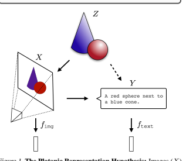
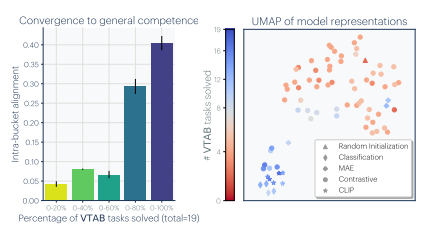
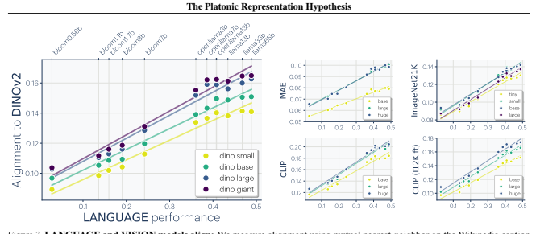
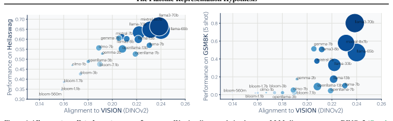
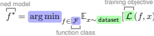
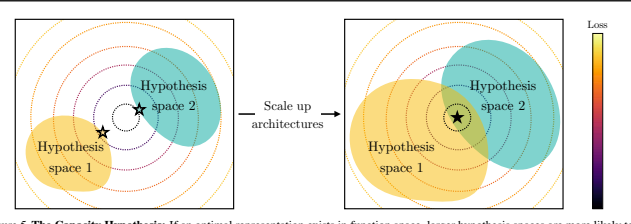
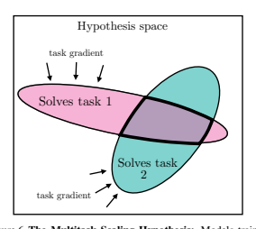
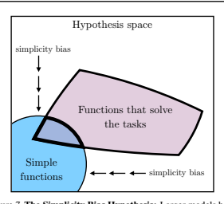
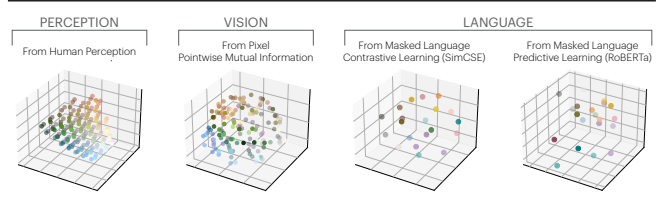
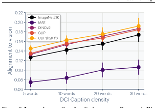

# Minyoung Huh * 1 **Brian Cheung** * 1 **Tongzhou Wang** * 1 **Phillip Isola** * 1

## Abstract

We argue that representations in AI models, particularly deep networks, are converging. First, we survey many examples of convergence in the literature: over time and across multiple domains, the ways by which different neural networks represent data are becoming more aligned. Next, we demonstrate convergence across data modalities:
as vision models and language models get larger, they measure distance between datapoints in a more and more alike way. We hypothesize that this convergence is driving toward a shared statistical model of reality, akin to Plato's concept of an ideal reality. We term such a representation the *platonic representation* and discuss several possible selective pressures toward it. Finally, we discuss the implications of these trends, their limitations, and counterexamples to our analysis.

Project Page: phillipi.github.io/prh Code: github.com/minyoungg/platonic-rep

## 1. Introduction

AI systems are rapidly evolving into highly multifunctional entities. For example, whereas in the past we had specialpurpose solutions for different language processing tasks
(*e.g.*, sentiment analysis, parsing, dialogue), modern large language models (LLMs) are competent at all these tasks using a single set of weights (Srivastava et al., 2022). Unified systems are also being built across data modalities: instead of using a different architecture for processing images versus text, recent models, such as GPT4-V (Achiam et al.,
2023), Gemini (Anil et al., 2023), and LLaVA (Liu et al.,
2023), handle both modalities with a combined architecture.

More and more systems are built off of general-purpose pretrained backbones, sometimes called foundation models (Bommasani et al., 2021), that support a large range of tasks, including robotics (Driess et al., 2023; Brohan et al., 2023), bioinformatics (Ma et al., 2024), and health-
*Equal contribution 1MIT. Correspondence to: Minyoung Huh
<minhuh@mit.edu>.

Proceedings of the 41 st *International Conference on Machine* Learning, Vienna, Austria. PMLR 235, 2024. Copyright 2024 by the author(s).

## The Platonic Representation Hypothesis

Neural networks, trained with different objectives

on different data and modalities, are converging to a shared statistical model of reality in their representation spaces.

care (Steinberg et al., 2021). In short, AI systems are becoming increasingly homogeneous in both their architectures and their capabilities.

This paper explores one aspect of this trend: representational convergence. We argue that there is a growing similarity in how datapoints are represented in different neural network models. This similarity spans across different model architectures, training objectives, and even data modalities.

What has led to this convergence? Will it continue? And ultimately, where does it end? Our central hypothesis, stated above in Figure 1, is that there is indeed an endpoint to this convergence and a principle that drives it: different models are all trying to arrive at a representation of reality, meaning a representation of the joint distribution over events in the world that generate the data we observe. Figure 1 conveys this hypothesis: there exists a real world (labeled Z), which we measure with various sensors, such as the camera shown to the left (X).

Other *projections* of these measurements, such as the textual description shown, can be produced from the first set of measurements or mediated by some other set of measurements, *e.g.*, touch or other camera views (dotted arrow from X to Y )
1. Representation learning algorithms find vector embeddings that statistically model the various measurements and projections. The resulting vector embeddings are all derived from the underlying reality in Z and thereby become aligned. As models are trained on more data and for more tasks, they require representations that capture more and more information about Z, and hence alignment toward Z increases toward a convergent point as a function of scale.

We call this converged hypothetical representation the "platonic representation" in reference to Plato's Allegory of the Cave (Plato, c. 375 BC), and his idea of an ideal reality that underlies our sensations. The training data for our algorithms are shadows on the cave wall, yet, we hypothesize, models are recovering ever better representations of the actual world outside the cave. This idea is not unique to Plato; our hypothesis is also related to the notion of "convergent realism" (Newton-Smith, 1981; Putnam, 1982; Doppelt, 2007; Hardin & Rosenberg, 1982) in the philosophy of science
(*i.e.*, that science is converging on truth), and to many arguments that have been put forth in the representation learning literature (*e.g.*, Tian et al. (2020a); Zimmermann et al.

(2021); Richens & Everitt (2024); Cao & Yamins (2024)).

Also closely related to our hypothesis is the "Anna Karenina scenario" described by Bansal et al. (2021), referring to the possibility that all well-performing neural nets represent the world in the same way. We discuss the evidence they give for this possibility in Section 2.

2 The platonic representation hypothesis refers to the situation where we are in an Anna Karenina scenario and the "happy representation" that is converged upon is one that reflects a statistical model of the underlying reality. We discuss the potential nature of this statistical model in more detail in Section 4.

## 2. Representations Are Converging

sentation by the similarity structure it induces, referred to as its kernel. Kernels are commonly used to assess representations (Kornblith et al., 2019; Klabunde et al., 2023);
this can be justified by the fact that they capture the relative structures among data samples, which are also the learning signal for many machine learning algorithms (Aronszajn, 1950; Smola & Scholkopf ¨ , 1998). Following prior literature, we define *representational alignment* as a measure of the similarity of the similarity structures induced by two representations, *i.e.*, a similarity metric over kernels. We give the mathematical definition of these concepts below:
- A **representation** is a function f : X → R
n that assigns a feature vector to each input in some data domain X .

- A **kernel**, K : *X × X →* R, characterizes how a representation measures distance/similarity between datapoints.

K(xi, xj ) = ⟨f(xi), f(xj )⟩, where ⟨ · , · ⟩ denotes inner product, xi, xj ∈ X and K ∈ K.

- A **kernel-alignment metric**, m: *K × K →* R, measures the similarity between two kernels, *i.e.*, how similar is the distance measure induced by one representation to the distance measure induced by another. Examples include Centered Kernel Distance (CKA) (Kornblith et al., 2019),
SVCCA (Raghu et al., 2017), and nearest-neighbor metrics (Klabunde et al., 2023).

In our experiments, we use a *mutual nearest-neighbor metric* that measures the mean intersection of the k-nearest neighbor sets induced by two kernels, K1 and K2, normalized by k. This metric is a variant of those proposed in Klabunde et al. (2023) and Oron et al. (2017). See Appendix A for the exact definition and Appendix B for comparisons with alternative alignment metrics.

Next, we explore several ways in which representations are converging. First, we argue that different neural networks are converging to aligned representations. Then, we show that this continues to hold across modalities, where image embeddings in vision models align with text embeddings in language models.

## 2.1. Different Models, With Different Architectures And Objectives, Can Have Aligned Representations

One indication of representational convergence is the rising number of systems built on top of pre-trained foundation models. These models are becoming standard backbones across a growing spectrum of tasks. Their versatility across numerous applications implies a level of universality in the way they represent data.

While this trend implies convergence toward a relatively small set of foundation models, it does not imply that *different* foundation models will arrive at the same representation.

Yet that is what has been observed by several recent papers.

Lenc & Vedaldi (2015) conducted one such study, in which

 

## 2.2. Alignment Increases With Scale And Performance

Figure 2. **VISION models converge as COMPETENCE increases:** We measure alignment among 78 models using mutual nearestneighbors on Places-365 (Zhou et al., 2017), and evaluate their performance on downstream tasks from the Visual Task Adaptation Benchmark
(VTAB; Zhai et al. (2019)). **LEFT:** Models that solve more VTAB tasks tend to be more aligned with each other. Error bars show standard error. **RIGHT:** We use UMAP to embed models into a 2D space, based on distance ≜
− log(alignment). More competent and general models (blue) have more similar representations.

they measured representational similarity through a technique called *model stitching*. Given two models, f and g, each composed of multiple layers (f = f1 *◦ · · · ◦* fn, g =
g1 *◦ · · · ◦* gm), an intermediate representation from f is integrated into g via a learned affine stitching layer h, resulting in a new stitched model F = f1 ◦· · ·◦fk ◦h◦gk+1 *◦· · ·◦*gm.

If F has good performance, it indicates that f and g have compatible representations at layer k, up to the transform h.

Kornblith et al. (2019) observed model alignment not only exists but also increases with model scale. On CIFAR10 classification (Krizhevsky et al., 2009), they found that larger models exhibit greater alignment with each other compared to smaller ones. Theoretically, Balestriero & Baraniuk
(2018) showed that models with similar outputs (*e.g.*, as a result of having high performance) also have similar internal activations. With the continuing trend of models scaling up, this suggests model alignment will increase over time
- we might expect that the next generation of bigger, better models will be even more aligned with each other.

In their study, Lenc & Vedaldi (2015) made two notable findings: (1) A vision model trained on ImageNet (Russakovsky et al., 2015) can be aligned with a model trained on the Places-365 dataset (Zhou et al., 2017) while maintaining good performance; (2) The early layers of these convolutional networks are more interchangeable than later layers.

The first finding illustrates a level of data independence where distinct image datasets lead to similar representations.

The second finding agrees with extensive research that oriented Gabor-like filters are common in both artificial and biological vision systems. This suggests a convergence to a similar initial layer of representation across various neural network architectures (Olshausen & Field, 1996; Krizhevsky et al., 2017). Bansal et al. (2021) expanded on the idea of model stitching, uncovering that models trained using selfsupervised objectives align closely with their supervised counterparts.

We expand upon this observation by evaluating the transfer performance of 78 vision models. These models were trained with varying architectures, training objectives, and datasets (detailed in Appendix C.1). In Figure 2 (left), we bin these models based on their average transfer performance on the VTAB dataset (Zhai et al., 2019), and then measure the average kernel alignment of the models within each bin. The results indicate that models with high transfer performance form a tightly clustered set of representations, while models with weak performance have more variable representations. We further visualize this structure with UMAP (McInnes et al., 2018) over models representation in Figure 2 (right). This suggests that models that are competent all represent data in a similar way. Echoing Bansal et al. (2021) and Tolstoy (1877), we might say: all strong models are alike, each weak model is weak in its own way.

Moschella et al. (2022) further demonstrated the feasibility of "zero-shot" model stitching without learning a stitching layer. Despite the fact that different text models were trained on different modalities, they found that the models often embed data in remarkably similar ways. In particular, they considered the kernel K defined by learned representations and showed that K serves as a bridge between models, allowing an encoder trained in one language, like English, to work effectively with a decoder in another, like French.

The discussion so far indicates that various models are aligning toward a unified representation. But does the convergence extend to model weights? While models with different architectures might not have compatible weight spaces, there exists ample evidence that models with the same architecture will often converge to the same basin of weights (Nagarajan & Kolter, 2019; Garipov et al., 2018; Lubana et al.,
2023). This holds even for models with different initializations, up to permutations over weight space (Ainsworth et al., 2022). Because of this, it is possible to merge sepa-
Dravid et al. (2023) extended this idea to individual neurons, and found "Rosetta Neurons" that are activated by the same pattern across a range of vision models. Such neurons form a common dictionary independently discovered by all models.

 

rately trained models of the same architecture, and achieve some of the capabilities of all models in the mixture (Stoica et al., 2023; Jordan et al., 2022; Wortsman et al., 2022).

## 2.3. Representations Are Converging Across Modalities

Do models trained on different data modalities also converge? Several works indicate that the answer is yes.

Merullo et al. (2022) extended model stitching to the crossmodal setting, finding that a single linear projection is sufficient to stitch a vision model to an LLM and achieve good performance on visual question answering and image captioning. Koh et al. (2023) showed that linear stitching can also work in the opposite direction, aligning text inputs to visual outputs. In fact, many recent language-vision models stitch pre-trained language and vision models together. For example, LLaVA (Liu et al., 2023) demonstrated state-ofthe-art results by projecting visual features into a language model with a 2-layer MLP.

Other works show further kinds of evidence of cross-modal synergy. Achiam et al. (2023) found that jointly training a language model with a vision model improves performance on language tasks, compared to training the language model on its own. Sharma et al. (2024) probed the visual knowledge of LLMs trained *only* on language data, by converting images into code that an LLM can process. They found that LLMs have rich knowledge of visual structures, to the extent that decent visual representations can be trained on images generated solely by querying an LLM to produce code and rendering the response. In visual generation, LLMs show abilities to augment captions with visual structures (*e.g.*,
bounding boxes and locations) and improve generation quality (Betker et al., 2023; Lian et al., 2023a;b; Wu et al., 2023).

In other modalities, Ngo & Kim (2024) showed auditory models are also roughly aligned with language models up to a linear transformation, and Ng et al. (2023) demonstrated the effectiveness of using pre-trained language models for facial motion prediction.

We set out to address these claims in a broader scope to determine whether models are indeed learning an increasingly modality-agnostic representation of the world. We sampled a variety of models trained either solely on vision or solely on language, and compared their representations as they became larger and more competent over many tasks.

In Figure 3, we assess alignment between a suite of language models and vision models. So far we have only defined alignment for two kernels defined over the same input space.

To measure cross-modal alignment, we use paired datasets to bridge the two modalities. For vision and text, we use the Wikipedia captions dataset {(xi, yi)}i (Srinivasan et al.,
2021), composed of images from Wikipedia (xi) and their corresponding captions (yi). We then measure alignment between a language model ftext and a vision model fimg as the alignment of the two following kernels:

$$K_{\rm img}(i,j)=\langle f_{\rm img}(x_{i}),f_{\rm img}(x_{j})\rangle\tag{1}$$ $$K_{\rm text}(i,j)=\langle f_{\rm text}(y_{i}),f_{\rm text}(y_{j})\rangle.\tag{2}$$

Using this analysis, we find that the better an LLM is at language modeling, the more it tends to aligns with vision

 

models, as shown in Figure 3. The converse effect also holds: the better a vision models is, the more it tends to align with LLMs. See Appendix C.2 for more details.

## 2.4. Models Are Increasingly Aligning To Brains

Neural networks also show substantial alignment with biological representations in the brain (Yamins et al., 2014).

This commonality may be due to similarities in the task and data constraints both systems are confronted with. Even though the mediums may differ - silicon transistors versus biological neurons - the fundamental problem faced by brains and machines is the same: efficiently extracting and understanding the underlying structure in images, text, sounds, etc (Barlow et al., 1961; Olshausen & Field, 1997).

The tasks that the human visual system has been honed to perform through evolution - like segmentation, detection, and whole-image classification - are also the ones that we train our neural nets to perform. Yamins et al. (2014) went as far as to title their work in the spirit that performance over such tasks implies brain alignment. Further, Conwell et al.

(2022) showed that training data plays a large role in alignment. Psychophysical studies have also shown agreement between how humans perceive visual similarity and how models do, even when the models are trained on tasks, such as self-supervised prediction, that are seemingly unrelated to mimicking human perception (Zhang et al., 2018).

## 2.5. Does Alignment Predict Downstream Performance?

If models are converging towards a more accurate representation of reality, we expect that alignment should correspond to improved performance on downstream tasks. Figure 4 supports this hypothesis by demonstrating improved performance on commonsense reasoning (Hellaswag; Zellers et al. (2019)) and mathematical problem solving (GSM8K;
Cobbe et al. (2021)) as alignment improves.

## 3. Why Are Representations Converging?

Modern machine learning models are generally trained to minimize the empirical risk with possible implicit and/or explicit regularization:

training objective  ## 1 Introduction  The _quantum_ quantum mechanics is a quantum field theory of quantum mechanics. It is a quantum field theory of quantum mechanics.  
In the following sections, we lay out how each colored component in this optimization process potentially plays a role in facilitating representational convergence.

## 3.1. Convergence Via **Task Generality**

Each training datapoint and objective (task) places an additional constraint on the model. As data and tasks scale, the volume of representations that satisfy these constraints must proportionately grow smaller, as visualized in Figure 6 and stated below:

## The Multitask Scaling Hypothesis

There are fewer representations that are competent for N tasks than there are for *M < N* tasks. As we train more general models that solve more tasks at once, we should expect fewer possible solutions.

This has been previously termed as the Contravariance principle by Cao & Yamins (2024), which states that the set of solutions to an easy goal is large, while the set of solutions to a challenging goal is comparatively smaller. Moreover, we argue that this narrower solution set also generalizes better. As data scales, models that optimize the empirical risk Ex∼ dataset [L(*f, x*)] also improve on the population risk Ex∼ reality [L(*f, x*)], and become better at capturing statistical structures of the true data generating process (reality).

task gradient simplicity bias
Recent work has demonstrated a power law relationship between data scale and model performance (Hestness et al.,
2017). This implies that with enough data (*e.g.*, consisting of the entire internet and all offline scientific measurements)
one ought to converge to a very small solution set with irreducible error - the inherent epistemic uncertainty of the world. As more models are trained on internet-scale data, the set of solutions that satisfies all data constraints must become relatively small.

In addition to data-scaling, many modern representation learning objectives L (*f, x*) directly optimize for multitask solving. Contrastive learning finds a distance structure over data samples that optimizes many classification tasks
(Arora et al., 2019b; Wang & Isola, 2020; Tian et al., 2020b).

Masked Autoencoders (He et al., 2021) optimize randomly sampled reconstruction tasks. In fact, autoregressive language modeling can also be seen as optimizing a diverse set of tasks (Radford et al., 2019). Such multi-task objectives may be more effective than single-task ones (*e.g.*, ImageNet classification) due to the fact that they impose more task constraints on the representation, leading to a smaller and higher-quality solution space (Chen et al., 2020; He et al.,
2020; Radford et al., 2017; 2019).

Hypothesis space

## 3.2. Convergence Via **Model Capacity**

Functions that solve the tasks Suppose there is a globally optimal representation for standard learning objectives. Then, under sufficient data, *scaling* a model (*i.e.*, using larger function classes F ), as well as improved optimization , should be more effective at finding better approximations to this optimum, as illustrated in Figure 5. With the same training objective, larger models, even of different architectures, will thus tend to converge toward this optimum. When different training objectives share similar minimizers, larger models are better at finding these minimizers, and will train to similar solutions over the training tasks. We summarize this hypothesis as follows:
Simple functions simplicity bias

## The Capacity Hypothesis

Bigger models are more likely to converge to a shared representation than smaller models.

## 3.3. Convergence Via **Simplicity Bias**

Arriving at the same mapping on the *training data* does not prohibit the models from developing distinct internal representations. It is not unreasonable to posit that the representations used to detect a dog in a 1M parameter model could be quite different than that used by a 1B parameter model. What would stop a billion-parameter (and counting) model from learning an overly complicated and distinct representation? One key factor might be simplicity bias:

task gradient simplicity bias

## The Simplicity Bias Hypothesis

Deep networks are biased toward finding simple fits to the data, and the bigger the model, the stronger the bias. Therefore, as models get bigger, we should expect convergence to a smaller solution space.

Such simplicity bias could be coming from explicit regularization R(f) commonly used in deep learning (*e.g.*,
weight decay and dropout). However, even in the absence of external influences, deep networks naturally adhere to Occam's razor, implicitly favoring simple solutions that fit the data (Solomonoff, 1964; Gunasekar et al., 2018; Arora et al., 2019a; Valle-Perez et al., 2019; Huh et al., 2023; Dingle et al., 2018; Goldblum et al., 2023). Figure 7 visualizes how simplicity bias can drive convergence.

## 4. What Representation Are We Converging To?

By now, we hope to have convinced the reader that task and data pressures, combined with increasing model capacity, can lead to convergence. We next turn our attention to *what* exactly is the endpoint of all this convergence.

Our central hypothesis, stated in Figure 1, is that the representation we are converging toward is a statistical model of the underlying reality that generates our observations.

Consistent with the multitask scaling hypothesis, such a representation would naturally be useful toward many tasks (or at least toward any task grounded in reality). Additionally, this representation might be relatively simple, assuming that scientists are correct in suggesting that the fundamental laws of nature are indeed simple functions (Gell-Mann, 1995), in line with the simplicity bias hypothesis.

But what exactly do we mean by "a statistical model of the underlying reality." In this section, we formalize one definition with concrete mathematical statements. *Importantly*,
this section should be read as just one concrete candidate for the form of the platonic representation; other candidates could be arrived at from other modeling assumptions.

## 4.1. An Idealized World

We consider a world that works as follows, consistent with the cartoon in Figure 1. The world consists of a sequence of T discrete events, denoted as Z ≜ [z1*, . . . , z*T ], sampled from some unknown distribution P(Z). Each event can be observed in various ways. An observation is a bijective, deterministic function obs : *Z → ·* that maps events to an arbitrary measurement space, such as pixels, sounds, mass, force, torque, words, etc. Later, in Section 6, we discuss limitations and potential extensions to continuous and unbounded worlds, and stochastic observations, that could yield a model that better reflects real learning scenarios.

One can think of an event as corresponding to the state of the world at some point in time3, but it is also fine to simply consider an event as any variable that indexes observations, with no further physical meaning4.

In this idealized world, knowing P(Z) would be useful for many kinds of predictions; this would constitute a world model over the events that cause our observations (Werbos, 1987; Ha & Schmidhuber, 2018; Richens & Everitt, 2024).

We will next show that a particular representation of P(Z)
is recovered by certain contrastive learners.

## 4.2. A Family Of Contrastive Learners Converge To A Representation Of P(Z)

Consider a contrastive learner that models observations that cooccur together. For simplicity, we ground our discussion with the following definition of the *cooccurrence probability*, Pcoor, of two observations xa and xb both occurring within some window Twindow:

$$P_{\mathsf{coor}}(x_{a},x_{b})\quad\propto\quad\sum_{(t,t^{\prime}):\;|t-t^{\prime}|\leq T_{\mathrm{window}}}\mathbb{P}(X_{t}=x_{a},X_{t^{\prime}}=x_{b}).$$

Analogously, we can define Pcoor for Z and other observation modalities. Note that Pcoor is symmetric.

Consider *positive pairs* as two observations nearby in time
(sampled from Pcoor) and *negative pairs* as observations 3Here we only analyze temporal sequences, but note that the same could be done with respect to events laid out in space instead.

4This latter interpretation may be more consistent with Plato's intent. Scholars have argued that his allegory of the cave rejects any notion of a true world state (Nettleship, 1897). Instead, we could say that the joint distribution of observation indices is *itself* the platonic reality.

drawn from any point in time (sampled independently from the marginal). Our contrastive learner tries to classify if a pair is positive or negative by learning a representation fX : X → R
dsuch that the dot-product kernel approximates the log odds ratio up to some offset:

$$\langle f_{X}(x_{a}),f_{X}(x_{b})\rangle\approx\log\frac{\mathbb{P}(\text{pos}\mid x_{a},x_{b})}{\mathbb{P}(\text{neg}\mid x_{a},x_{b})}+\tilde{c}_{X}(x_{a})\tag{3}$$ $$=\log\frac{P_{\text{cor}}(x_{a}\mid x_{b})}{P_{\text{cor}}(x_{a})}+c_{X}(x_{a})$$ (4) $$=K_{\text{PMI}}(x_{a},x_{b})+c_{X}(x_{a}),\tag{5}$$

where KPMI is the pointwise mutual information (PMI) kernel, and cX(xa) is constant in xb. We note that is a common setting for self-supervised contrastive learners with NCE objectives (Gutmann & Hyvarinen ¨ , 2010; Oord et al., 2018),
such as SimCLR (Chen et al., 2020) and SimCSE (Gao et al., 2021). (See Oord et al. (2018) and Appendix F.1 for details.)
Under mild conditions that the world is smooth enough (see Appendix F.2), a choice of fX can exactly represent KPMI:

$$\langle f_{X}(x_{a}),f_{X}(x_{b})\rangle=K_{\mathsf{PMI}}(x_{a},x_{b})+c_{X},$$

where we observed that cX(xa) from Equation (5) must be a constant since both sides are symmetric.

Therefore, the contrastive learners we consider are minimized by a representation fX whose kernel is KPMI (up to a constant offset). With sufficient data and optimization, we will observe convergence to this point.

Thus we have convergence to a representation of the statistics of X, but what about Z? Recall that our idealized world consists of *bijective* observation functions, which, over discrete random variables, preserve probabilities. So we have:

$$\begin{array}{l}{{P_{\mathrm{coor}}(x_{a},x_{b})=P_{\mathrm{coor}}(z_{a},z_{b})}}\\ {{K_{\mathrm{PMI}}(x_{a},x_{b})=K_{\mathrm{PMI}}(z_{a},z_{b}),}}\end{array}$$

where we use Pcoor and KPMI in a modality-agnostic way to emphasize that different modalities share the same such quantities.

All these arguments hold not just for X but also for Y (or any other bijective, discrete modality), implying:

$$K_{\text{PMI}}(z_{a},z_{b})=\langle f_{X}(x_{a}),f_{X}(x_{b})\rangle-c_{X}\tag{7}$$ $$=\langle f_{Y}(y_{a}),f_{Y}(y_{b})\rangle-c_{Y}.\tag{8}$$

Therefore, for any modality in our idealized world, we observe representational convergence to the same kernel, which represents certain pairwise statistics of P(Z).

This analysis suggests that certain representation learning algorithms may boil down to a simple rule: *find an embedding in which similarity equals PMI*. We note that this idea is consistent with prior works that have used PMI as a similarity measure for clustering in vision and language
(*e.g.*, Isola et al. (2014); Isola (2015); Isola et al. (2016);
Chambers & Jurafsky (2008)).

A study in color We conduct a case study to verify that convergence does happen on real data. Abdou et al. (2021)
discovered that color distances in learned language representations, when trained to predict cooccurrences in *text*
(Devlin et al., 2018), closely mirror human perception of these distances, which we reproduce in Figure 8 with both contrastive and predictive models. Interestingly, they noted an increasing similarity as models scale larger and become better at modeling *text* cooccurrences. In Figure 8, we also learn representations of color based on KPMI from cooccurrences in *images*. Indeed, learning cooccurrence statistics in either domain recovers roughly the *same* perceptual representation. Details of this experiment are described in Appendix D.

We believe that our simple model encapsulates essential aspects of complex real-world systems, and offers a path toward understanding the representation that models are converging to—a unified model that is proficient across various domains and modalities, grounded in the statistical properties of the underlying world. Section 6 further elaborates some limitations.

## 5. What Are The Implications Of Convergence?

Scaling is sufficient, but not necessarily efficient Our arguments are roughly in line with the claim that "scale is all you need" to reach high levels of intelligence. We have argued that as resources are scaled (\# parameters, \# datapoints,
\# flops), representations are converging, regardless of other modeling choices and even data modality. Does this mean that scale is all that matters? Not quite: different methods can scale with different levels of *efficiency* (Hestness et al.,
2017; Kaplan et al., 2020), and successful methods must still satisfy some general requirements (*e.g.*, be a consistent estimator, model pairwise statistics of P(Z)).

Training data can be shared across modalities Suppose you have access to N images and M sentences, and want to learn the best representation. If there is indeed a modalityagnostic platonic representation, then the image data should help find it, and so should the language data. The implication is that if you want to train the best vision model, you should train not just on N images but also on M sentences.

This is already becoming common practice (Achiam et al.,
2023; Radford et al., 2021). Many vision models are finetuned from pre-trained LLMs. The other direction is less common, but also is implied by our hypothesis: if you want to build the best LLM, you should also train it on image data. Indeed, Achiam et al. (2023) claim evidence that this is true, where training on images improved performance on text. In theory, there should be some conversion ratio: a pixel is worth a words for training LLMs, and a word is worth b pixels for training vision models.

Ease of translation and adaptation across modalities When two representations are aligned, transitioning from one to the other should be a simple function that's easily obtained. Our hypothesis could explain the phenomenon that conditional generation is easier than unconditional (Mirza & Osindero, 2014; Liu et al., 2020; Sauer et al., 2022), as the data we condition on may have the same platonic structure as the data we are generating. In line with this, recent work has found that representation-conditioning is even easier (Li et al., 2023). Similarly, representational convergence could act as a bridge that lets us find mappings between domains even without paired data; this may underlie the success of unpaired translation in vision (Zhu et al., 2017; Shi et al.,
2024; Xie et al., 2022) and language (Tran et al., 2017; Lample et al., 2018). We emphasize that this doesn't mean that models trained on a single modality (*e.g.*, language) can immediately process raw data from another (*e.g.*, vision).

What makes them adaptable to the new modalities is that they share a common modality-agnostic representation, and can readily process *representations* of new modalities. Furthermore, this implies that language models would achieve some notion of grounding in the visual domain even in the absence of cross-modal data.5 The primary advantage of cross-modal data could then simply be sample efficiency.

Scaling may reduce hallucination and bias A prominent shortcoming of current LLMs is their propensity to hallucinate, or output false statements. If models are indeed converging toward an accurate model of reality, and scale powers this convergence, then we may expect hallucinations to decrease with scale. Of course, our hypothesis is conditioned on the training data for future models constituting a sufficiently lossless and diverse set of measurements.

This may not come to pass, but it is an implication of our hypothesis worth pointing out. A similar argument can be made about certain kinds of bias. It has been shown that large models can exacerbate existing biases present in their training data (Hall et al., 2022). Our hypothesis implies that, while this may be true, we should expect *larger* models to amplify bias *less*. This does not mean bias will be removed, rather that the model's biases will more accurately reflect the data's biases, rather than exacerbating them.

## 6. Counterexamples And Limitations

Different modalities may contain different information One immediate objection to our hypothesis is: what about the information that is unique to a given modality? Can language really describe the ineffable experience of watching a total solar eclipse? Or, how could an image convey the a concept like "I believe in the freedom of speech," which is easy to write in English? Two different models cannot converge to the same representation if they have access to fundamentally different information.

More precisely, our mathematical argument in Section 4 only strictly holds for bijective projections of Z, so that the information in all the projections is equivalent to the information in the underlying world. This will not hold true for either lossy or stochastic observation functions. Nonetheless, similar arguments have been made theoretically and empirically that cooccurrence relations are learned by practical contrastive (Wang & Isola, 2020; Zimmermann et al.,
2021) and predictive learners (Papyan et al., 2020). Lu 5In 1688, William Molyneux posed the question: could someone born blind, upon being given sight, be able to distinguish shapes by vision alone? (Locke, 1690) Our arguments suggest an answer: not immediately, but after a bit of visual experience
(to form a visual representation) it should be easy (by mapping to prior touch-based representations). Empirical data shows that indeed congentially blind children given sight can quickly learn such abilities (Held et al., 2011).

et al. (2021) and Mirchandani et al. (2023) also showed that models trained to autoregressively generate text also capture statistical relations in many other modalities, including symbolic reasoning, vision, protein folding, and robotics.

A more nuanced version of our hypothesis will need to be developed to handle the case of non-bijective observations and abstract concepts. A starting point could be: different models will converge to the same representation *when the* input signals are sufficiently high information and the models are sufficiently high capacity; when they are not, the lower-information representation will only align with the higher-information one up to a level capped by the mutual information between the input signals and by the capacity of each model. This cap might or might not be practically important. Popular representations like CLIP are explicitly optimized to only capture the shared information between vision and language, yet are highly successful on many pure vision tasks. We perform a preliminary test of the effect of information level in Figure 9 (detailed in Appendix E), and find that the more descriptive (higher information) a caption is, the better its LLM representation aligns with the visual representation of the corresponding image.

Not all representations are presently converging Our argument has mainly focused on two modalities: vision and language. While we do expect other modalities will follow similar trends, we have yet to see the same level of convergence across all domains. For example, in robotics there is not yet a standardized approach to representing world states in the same way as there is for representing images and text. One limitation lies in the hardware used in robotics, which is often expensive and slow. This creates a bottleneck in the quantity and diversity of training data.

Sociological bias in producing AI models Researcher bias and collective preferences within the AI community have shaped the trajectory of model development. There is often an explicit or implicit goal of designing AI systems that mimic human reasoning and performance, and this could lead to convergence toward human-like representations even if other kinds of intelligence are in fact possible.

Additionally, the "hardware lottery" (Hooker, 2021) suggests that the success of AI models can also depend on the compatibility of their design with available computational architectures, further contributing to convergent trends.

Special-purpose intelligences might not converge Different intelligent systems can be designed to accomplish different tasks. For instance: A bioinformatics systems might predict protein structure; an autonomous vehicle might follow lanes on highways. It's possible that not much is shared between these two narrow tasks. Our argument only holds for intelligences that are optimized to perform well on *many* tasks. We have argued that a representation of *reality* is a structure that is useful across many tasks, but for any special purpose there may be shortcuts, or even effective representations detached from reality. Such shortcuts may be more efficient and necessary for continued improvements in specific domains. This will become more relevant if continued scaling comes up against boundary conditions around resources like energy and compute.

How do we measure alignment? We focused on one particular alignment measure, mutual nearest-neighbor, in our experiments, and cited experiments using several others.

However, there is active debate on the merits and deficiencies of all these ways of measuring alignment (Bansal et al.,
2021; Sucholutsky et al., 2023). We discuss our choice and show results for other alignment metrics in Appendix A.

Lots left to explain We have shown results where different models arrive at *similar* but not the *same* representations. For example, in Figure 3, alignment clearly increases but only reaches a score of 0.16, according to our mutual nearest-neighbor metric. The maximum theoretical value for this metric is 1. Is a score of 0.16 indicative of strong alignment with the remaining gap being "noise" or does it signify poor alignment with major differences left to explain? We leave this as an open question.

## Acknowledgements

We thank Lindsey & Brown for sharing their data for our experiments shown in Figure 8. We thank the anonymous reviewers for helpful feedback, and for providing the coun-